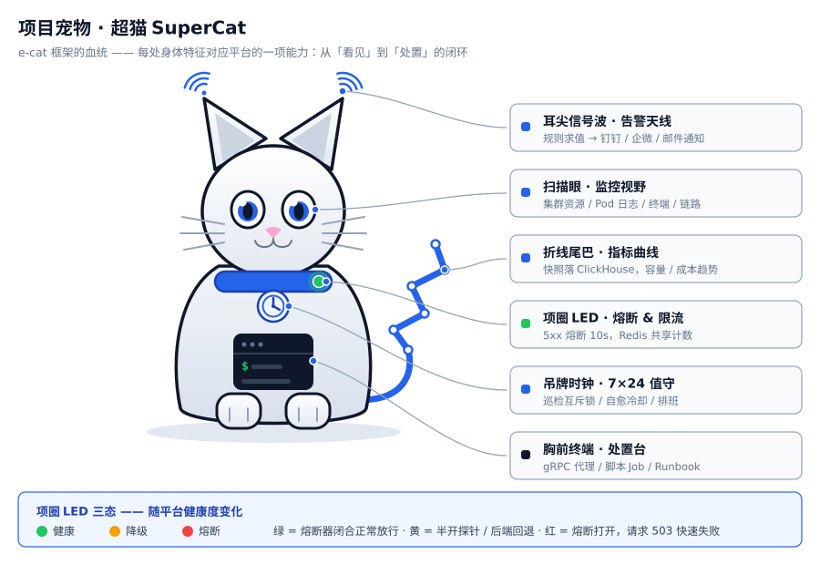
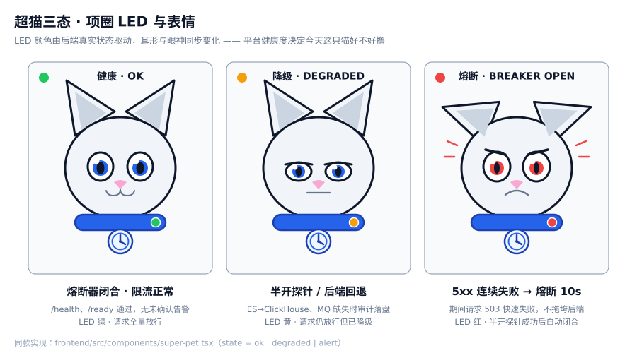

# SuperOps — Intelligent Ops Platform

<p align="center">
  
</p>

<p align="center"><em>SuperCat · the SuperOps project mascot — signal waves on the ears are the alert antenna, the collar LED is the circuit-breaker indicator</em></p>

An intelligent operations platform built on the [e-cat](https://github.com/erik/e-cat) framework ecosystem (v1.9.0). An API gateway provides auth, rate limiting, circuit breaking, proxying and GraphQL; a Kubernetes resource service provides queries, logs, Watch and terminal exec; a Collector handles metric snapshots, inspection, alerts and domain-event publishing; a Tauri desktop frontend completes the picture.

## Project Mascot

**SuperCat** — named after the e-cat framework, shaped by the platform's four capabilities. Every body part maps to something that really exists in this repo (the sheet above is the reference art):

| Body part | Capability | Code |
|---|---|---|
| Ear signal waves | Alert antenna: rule evaluation (N consecutive breaches) → notification channels | `services/collector/src/alert.rs` |
| Blue scanning eyes | Monitoring vision: cluster resources / pod logs / live terminal / traces | `services/k8s/src/resource/`, `frontend/src/pages/` |
| Sparkline tail | Metric curve: periodic snapshots into ClickHouse, capacity & cost trends | `services/collector/src/collect.rs` |
| Collar LED | Circuit breaker & rate limit: 5xx trip for 10s, Redis shared counters | `services/gateway/src/breaker.rs` |
| Dog-tag clock | 7×24 on-call: inspection mutex, self-heal cooldown, on-call rotation | `services/collector/src/inspect.rs` |
| Chest terminal | Action console: gRPC proxy, script jobs, runbooks | `services/gateway/src/proxy/`, `scripts_api.rs` |

The collar LED has three states, mapped 1:1 to backend state (green = breaker closed, traffic passes / amber = half-open probe or backend fallback / red = breaker open, requests fail fast with 503):



**It already works here**: `frontend/src/components/super-pet.tsx` is the same design as an inline-SVG React component (`state` drives ear posture, expression and LED).

- Login page logo, sidebar logo — `SuperPet`
- Browser favicon — `frontend/public/pet-icon.svg`
- Tauri desktop app icons — `frontend/src-tauri/icons/` (32 / 128 / 256 / 512)
- Dashboard "SuperCat on duty" card — expression follows the backend's unacknowledged alert levels (`CRIT*` → alert, `WARN*` → degraded, none → ok); the "active alerts" stat card is fed from the same source

## Overview

SuperOps targets small-to-medium infrastructure operations with a closed loop from "seeing" to "acting":

- **See**: cluster resources (Pod/Deployment/Node), pod logs, live terminals, metric snapshots and alerts
- **Resilience**: rate limiting (Redis shared counters + Consul dynamic thresholds), circuit breaking (auto half-open after consecutive 5xx), auth (JWT / OAuth2 / API Key), service-to-service gRPC bearer auth with optional TLS
- **Observability**: Prometheus metrics, OTLP tracing (Jaeger), ClickHouse time-series storage
- **Coordination**: Consul / etcd registration + remote config, Kafka / MQTT / NATS audit event bus
- **On-call**: alert noise reduction (N consecutive breaches + open-window dedup), self-heal cooldown & replica caps, distributed lock for periodic tasks (runs once across instances), cluster registry persistence (survives restart)
- **Closed loop**: alert → ticket → runbook → approval → release/rollback → audit, every action recorded

Four phases (all complete): P1 MVP (auth + resource queries) → P2 resilience & observability (circuit breaker, rate limit, registry, tracing) → P3 integration & API surface (exec terminal, API Keys, OAuth2, OpenAPI) → P4–P6 operations loop (P4 write ops / audit / user management → P5 logs / CMDB / scripts / RBAC → P6 governance / approvals / multi-tenancy / vault / recordings / files / alerts / metrics / Helm) → ecosystem expansion (chaos drills / resource quotas / release rollback / WAF scanning / config drift / refined alert notifications / load testing & TLS) → framework deep-dive (CMDB asset topology on graph DB / ES log search / S3 backup storage / MQTT·NATS messaging / etcd registry / GraphQL API / ecat-events domain events) → phase-2 hardening (cluster registry persistence / alert noise reduction / self-heal cooldown / task distributed lock / gRPC TLS / image & bench CI).

## Architecture

```
┌────────────┐   HTTP/WS  ┌─────────────┐   gRPC   ┌────────────┐
│  Frontend  │ ─────────► │   Gateway   │ ───────► │  K8s svc   │ ──► Kubernetes API
│ Tauri/Web  │   :8080    │ auth+limit  │  :9091   │   :9091    │
└────────────┘            └──────┬──────┘          └────────────┘
                                 │ gRPC
                          ┌──────▼──────┐
                          │  Collector  │────► ClickHouse (snapshots/alerts/domain events)
                          └──────┬──────┘
                                 │
     MySQL (users/keys) Redis (rate limit/lock) Kafka/MQTT/NATS (messaging) Consul/etcd (registry/KV) Prometheus/Jaeger
     Neo4j (asset topology) Elasticsearch/OpenSearch (log search) MinIO (backup objects) GraphQL (/api/graphql)
```


**Request path**: browser → Gateway (auth → rate limit → breaker → proxy) → K8s service (gRPC) → Kubernetes API; terminals are bridged WebSocket ↔ gRPC bidi stream. **Config path**: Consul KV `config/superops/gateway/*` changes are pushed in real time via blocking queries — `rate.limit.max`/`rate.limit.window` apply immediately. **Observability path**: Gateway exposes `/metrics` (scraped by Prometheus) and OTLP spans (shown in Jaeger).

### Diagram Gallery

**Architecture design**: request flow (`flow.svg`), layering & dependency direction (`design.svg`)


**Functional design**: feature structure & module ownership (`structure.svg`)


**Security**: WAF → auth → rate limit → circuit breaker, four layers (`security.svg`)


**Lifecycle**: startup / running / shutdown (`lifecycle.svg`)


## Project Layout

```
super-ops/
├── services/                  # backend services (one binary each)
│   ├── gateway/               #  API gateway :8080
│   │   └── src/
│   │       ├── auth/          #    JWT issue/verify (ecat-auth), API Keys, OAuth2 short-circuit, login/register
│   │       ├── proxy/         #    k8s reverse proxy (HTTP queries + WS terminal bridge)
│   │       ├── k8s_client.rs  #    gRPC client (injects Bearer when auth.token is set)
│   │       ├── breaker.rs     #    circuit breaker (FiveXx→Error chain)
│   │       ├── config_remote.rs #  Consul KV hot reload (DynamicRateLimitStore)
│   │       ├── metrics*.rs    #    Prometheus export + metrics query API
│   │       ├── cmdb_api.rs / logs_api.rs / scripts_api.rs #  log search / CMDB / scripts
│   │       ├── cmdb_topology.rs #  CMDB asset topology (graph DB sync/query/explore)
│   │       ├── graphql.rs    #    GraphQL schema (ecat-graphql, /api/graphql)
│   │       ├── domain_events.rs #  domain-event consumption → ClickHouse domain_event
│   │       ├── approval_api.rs #   approval workflow (delete gate)
│   │       ├── secrets_api.rs / vault.rs # secret vault (AES-256-GCM, 503 without master key)
│   │       ├── recordings_api.rs / recorder.rs # terminal recordings (ClickHouse exec_session)
│   │       ├── files_api.rs   #    file upload/download (10MB multipart, MinIO)
│   │       ├── alerts_api.rs  #    alert center (list/ack)
│   │       └── openapi.rs     #    /api/docs
│   ├── k8s/                   #  K8s resource service :9091 (gRPC)
│   │   └── src/
│   │       ├── cluster/       #    cluster management (kubeconfig CRUD + MySQL persistence, in-memory fallback)
│   │       ├── resource/      #    pod/deploy/node/exec/metrics + job (RunJob) queries
│   │       ├── main.rs        #    service-to-service Bearer auth (auth.token) + optional gRPC TLS
│   │       └── service.rs     #    tonic service (log stream / Watch / exec bidi + RunJob)
│   └── collector/             #  metric collection, inspection & log collection
│       └── src/
│           ├── collect.rs     #    periodic collection → ClickHouse snapshots
│           ├── logtail.rs     #    Pod log collection → ClickHouse (Redis cursor, rotation-safe)
│           ├── inspect.rs     #    inspection + generic task lock (drift/rollback/housekeeping mutex)
│           ├── alert.rs       #    alert noise reduction (N consecutive + open dedup) & self-heal cooldown
│           ├── notify.rs      #    notification channels (generic/dingtalk/wecom webhook + SMTP + on-call)
│           ├── drift.rs       #    config drift detection (CMDB vs actual)
│           ├── rollback.rs    #    automatic release rollback (observation window)
│           ├── housekeeping.rs #   governance: MySQL backup / capacity & cost estimates
│           ├── events.rs      #    audit event consumption (Kafka / MQTT / NATS)
│           ├── domain_events.rs #  alert/drift/rollback domain-event publishing (ecat-events)
│           └── mq.rs          #    messaging backend assembly (mqtt > nats > kafka)
├── frontend/                  # React + Vite + Tauri 2 (:3000)
│   ├── public/pet-icon.svg    #  SuperCat icon (favicon)
│   ├── src-tauri/icons/       #  desktop app icons (SuperCat, 32/128/256/512)
│   └── src/
│       ├── components/super-pet.tsx # SuperCat component (inline SVG, state = ok | degraded | alert)
│       └── pages/            #  k8s (clusters/Pods/Nodes/terminal/logs) + cmdb + ops (audit/API Keys/users/scripts/alerts/metrics/log search/recordings/approvals/secrets/files)
├── ecat-*/                    # e-cat framework crates (workspace members)
├── superops-protos/           # generated protobuf code (common.v1 / k8s.v1)
├── protos/                    # proto sources (managed by buf)
├── bench/                     # ecat-bench load-test entry (BENCH_TARGET=health|login)
├── config/                    # per-service YAML configs
├── deploy/                    # docker-compose.yml + init.sql + prometheus.yml + helm/superops (Chart)
└── docs/                      # audit report / plans / architecture diagram
    └── images/                #  architecture / design / structure / flow / security / lifecycle / tree
                               #  + pet.svg (mascot sheet) / pet-states.svg (three states) / pet-icon.svg
```


## Features

### Gateway (:8080)
| Feature | Description |
|---|---|
| Auth | login/register; JWT sign/verify via framework ecat-auth (HS256, unified `AuthClaims` injection, secret ≥32 bytes enforced); optional OAuth2 layer (ecat-auth, enabled by adding an `oauth2` config block); `X-API-Key` in-memory store (instant revocation); query-token fallback for WS; role system admin/operator/viewer (first registered user becomes admin; operator gets api:read/api:write/ops:audit/ops:cmdb/ops:scripts, viewer is api:read-only; API Keys resolve through the same role mapping) |
| Rate limit | login 10 req / 60s / IP; Redis shared counters (falls back to memory); thresholds hot-reload via Consul KV |
| Circuit breaker | k8s proxy trips after consecutive 5xx (50% failure / 30s window / half-open probe 3), 503 while open |
| Service-to-service auth | every gateway → k8s-service gRPC call carries `authorization: Bearer <token>` (enabled when `services.k8s.token` is set; must match k8s-service.yaml `auth.token`); empty means plaintext (local dev) |
| Proxy | `/api/k8s/*` → gRPC (queries + scale/restart/delete write ops); `/exec` WebSocket ↔ gRPC bidi stream (incl. terminal resize, write route require_role("api:write")); write ops publish Kafka audit events (`k8s.scale`/`k8s.restart`/`k8s.delete`, payload includes `level: "INFO"`) |
| Log search | `GET /api/logs/search`: collector logtail dual-writes (ClickHouse + optional indexing into a search backend); search dispatches per `search:` config (Elasticsearch / OpenSearch bool/term/match/range DSL, automatic ClickHouse fallback when the backend fails), require_role("api:read") |
| CMDB assets | `/api/cmdb/assets` (GET list / POST create), `/api/cmdb/assets/{id}` (DELETE), `/api/cmdb/stats` (GET), require_role("ops:cmdb") |
| CMDB asset topology | graph-DB backend (`graph:` block, neo4j / nebulagraph / arangodb): `POST /api/cmdb/topology/sync` (assets → graph nodes + depends_on edges upsert, orphan cleanup), `GET /api/cmdb/topology` (nodes/edges), `POST /api/cmdb/topology/explore` (native graph query, 4KB cap); frontend `/cmdb` "Topology" tab (hand-written SVG ring layout), ops:cmdb |
| GraphQL | `POST /api/graphql`: ecat-graphql schema (`health` / `cmdbStats` / `alerts` / `backups` queries), require_role("api:read") |
| Domain events | collector alert / config drift / auto-rollback publish DomainEvents over the ecat-events bus → gateway consumes into ClickHouse `domain_event`; `GET /api/events?limit=&event_type=` (ops:audit); frontend `/ops/events` page |
| Script library | `/api/scripts` (GET/POST), `/api/scripts/{id}` (DELETE), `/api/scripts/{id}/run` (POST → k8s Job batch execution), `/api/scripts/runs` (GET run history), shell only (busybox:1.36), require_role("ops:scripts") |
| Approvals | deletion gate for deployments (412 without an approved request when `approval.enabled`); `GET/POST /api/approvals` (kind=delete, target `"{cluster_id}/{ns}/{name}"`), `POST /api/approvals/{id}/decide`; **off by default** |
| Multi-tenancy | `x-tenant-id` header parsed by `require_tenant` middleware (lowercase alnum/dash 1..=64, falls back to `default`); cmdb/scripts data filtered by `tenant_id` |
| Vault | `/api/secrets` (GET list / POST create / GET+DELETE single, AES-256-GCM); all endpoints return 503 without a valid `SUPEROPS_MASTER_KEY` (32 bytes); ciphertext never logged |
| Recordings | exec WebSocket frames mirrored to ClickHouse `exec_session` (side channel; frames carry a per-session seq, replay ordered by timestamp, seq); `/api/recordings` (GET list), `/api/recordings/{sid}/frames` (GET, up to 5000 frames), `/api/recordings/{sid}` (DELETE); read api:read / write api:write; `recording.enabled` config switch (on by default) |
| Files | `POST /api/files` (multipart, 10MB limit, filename whitelist) + `GET /api/files/{name}`, stored in MinIO, api:write/api:read |
| Alert center | `GET /api/alerts?level=&limit=50` (ClickHouse `alert_event`, ops:cmdb), `POST /api/alerts/{id}/ack` (api:write, idempotent), `GET /api/alerts/acks` |
| Backups | `/api/backups/status` (GET list / POST report, agent callbacks via API key), `/api/backups/summary` (per-db summary + freshness), `/api/backups/objects` (S3/MinIO bucket object list, available when the `storage:` block is configured); frontend `/ops/backups` page includes a backup-storage object card |
| Metrics page | frontend `/ops/metrics` reuses `GET /api/v1/metrics/query` (api:read) |
| Alert notifications | generic/DingTalk/WeCom webhooks + SMTP email (`kind=email`, comma-separated recipients, password overridable via `SUPEROPS_SMTP_PASSWORD`); `levels` field filters delivery by severity (all when unset); current on-call person appended to email/webhook notifications (needs mysql); per-target silence window (default 300s) |
| Security scan (WAF) | outermost request WAF layer (ecat-security `SecurityBodyLayer`): scans URI+headers+body (up to 10MB, body replayed to handler); SQLi/XSS etc. High/Critical hits → 403 `{"error":...}`, lower severities logged only |
| Release pipeline | k8s-service gRPC `UpdateImage` (deployment image update) + `/api/releases` (GET/POST records) + `/api/releases/{id}/rollback` (manual rollback to previous image, 400 without one) + release page (rollback button + confirm); collector `rollback` task auto-rolls back (release ok → enter observation window after `delay` seconds; deployment ready==0 or missing → restore old image, mark failed, **off by default**) |
| Chaos drills | `/api/chaos` (GET/POST experiment CRUD), `/api/chaos/{id}` (DELETE), `/api/chaos/{id}/run` (POST restart/delete via k8s-service), ops:cmdb; frontend `/ops/chaos` page |
| Resource quota | `resource_quota` table (UNIQUE cluster_id+namespace) + `/api/quota` (GET/POST upsert, replicas limit), `/api/quota/{id}` (DELETE), ops:cmdb; frontend `/ops/quota` page |
| MySQL TLS | `database.tls` config block (ecat-tls): ca_cert/client_cert/client_key PEM paths + skip_verify (true=encrypt-only without domain check / false=VerifyIdentity full check) |
| Governance | collector `housekeeping`: MySQL backup (mysqldump → `data/backups`, keep N), disk capacity & cost estimates (collector.yaml `housekeeping:` block) |
| Observability | `/health`, `/ready` (MySQL dependency check), `/metrics` (Prometheus), `/api/docs` (OpenAPI 3.0.3), OTLP spans (gateway/k8s/collector) |
| Ops | Consul registration + `discover("superops-k8s")` endpoint resolution (static fallback); KV hot reload |

### K8s Service (:9091)
Cluster management (kubeconfig CRUD + **MySQL persistence**: registrations are stored when `database.url` is set and reloaded at startup, falling back to in-memory with a WARN when the DB is unreachable), Pod/Deployment/Node queries (Node incl. Ready status & kubelet version), pod resource metrics (gRPC `GetMetrics`), Deployment scale/restart/delete write ops (gRPC `ScaleDeployment`/`RestartDeployment`/`DeleteDeployment`), batch execution (gRPC `RunJob` → batch/v1 Job, shell scripts), pod log streams (tail/follow), resource Watch (ADDED/MODIFIED/DELETED), exec bidi stream (stdin/stdout/stderr + resize); server-side auth (`auth.token` set → unauthenticated calls get 401) and optional **gRPC TLS** (`tls:` block: cert/key plus optional `require_client_auth` mTLS, off by default).

### Collector
Periodic metric collection → ClickHouse snapshots; log collection (logtail.rs: periodic Pod log ingestion → ClickHouse with a **Redis cursor** resuming each pod where it left off and falling back to a full read when the cursor line disappears (log rotation); `cursor_ttl_secs` bounds cursor retention; per-line indexing into Elasticsearch / OpenSearch when the `search:` block is set); inspection and periodic tasks take a **distributed lock** so only one instance runs them (inspect.rs `with_task_lock`, 300s TTL, shared by drift / rollback / housekeeping); alert rules (read MySQL `alert_rule`, `alert_consecutive` N-breach streaks + open-window dedup, `max_not_ready` node-alert cap, `action=restart/scale` self-heal — `selfheal.enabled` off by default and bounded by cooldown and replica caps, alerts also published as domain events via ecat-events); alert notifications (generic/DingTalk/WeCom webhooks + SMTP email `kind=email`, `levels` severity filter + on-call person appended, per-target silence window, default 300s); config drift detection (drift.rs: CMDB deployment assets vs cluster actual deployments, differences written to ClickHouse `drift_event` and published as domain events, `drift.enabled` **off by default**); release auto-rollback (rollback.rs: `status=ok` releases enter a `window_secs` observation window after `delay_secs`; deployment missing or ready==0 with replicas>0 → restore old image and mark failed, rollbacks published as domain events, `rollback.enabled` **off by default**); governance (housekeeping.rs: MySQL backup + capacity/cost estimates); audit event consumption (events.rs, messaging backend assembled by `mqtt:` / `nats:` / `mq:` priority, see mq.rs); domain-event publishing (domain_events.rs, ecat-events remote bus reusing the messaging backend); registry (on_start: registers into etcd when the `etcd:` block is set — 30s lease + `superops/services` prefix — otherwise falls back to Consul); OTLP span export.

### Frontend (:3000)
Login, cluster list/detail, pod list & logs, deployments, nodes, terminal page (WS bidi, query-token auth, binaryType handling, optional container, pre-session confirm + server-side timeout); dashboard cards wired to real data (cluster count / Docker host count (metrics query, temporary `app` metric) / active alerts (wired to the alert center API since P6)) + cluster health aggregate card (per-cluster node/Pod Ready + totals); CMDB assets page (`/cmdb`, ProTable + create dialog + "Topology" tab (hand-written SVG ring layout: asset-type color bar, status stroke, sync button), menu between Kubernetes and Ops Center); script library page (`/ops/scripts`, dual ProTable for scripts + run history); ops center (`/ops/audit` audit log, `/ops/apikeys` API Keys, `/ops/users` user management, `/ops/alerts` alert center (10s polling + ack + one-click ticket), `/ops/alert-rules` alert rules (CRUD + enable switch), `/ops/metrics` metrics dashboard (reuses the metrics query API), `/ops/logs` log search (filters + time range), `/ops/recordings` terminal recordings (frames ordered by seq, playback), `/ops/approvals` approval center (status filter + approve/reject/cancel/reopen), `/ops/secrets` secret vault (encrypted storage + decrypted view/copy, 503 notice when master key unset), `/ops/files` file manager (multipart upload / download by name), `/ops/oncall` on-call schedule, `/ops/traces` trace viewer (Jaeger UI embed), `/ops/tickets` tickets (status flow), `/ops/releases` release pipeline (image update + records + rollback button), `/ops/chaos` chaos drills (experiment CRUD + run), `/ops/runbooks` runbooks (step execution), `/ops/capacity` capacity/cost trends (hand-written SVG), `/ops/backups` DB backup status (incl. backup-storage object card), `/ops/events` domain events (type filter + severity coloring), `/ops/config` config center (Consul KV browse/edit/delete), `/ops/quota` resource quota (cluster+namespace limits), `/ops/grafana` Grafana embed page (iframe sandbox, URL priority `?url=` > `VITE_GRAFANA_URL` > localhost:3000)); standalone Pods/Deployments/Nodes pages now carry a cluster picker (first cluster by default, no longer hardcoded to `default`; embedded pages in the cluster detail view are unaffected); the SuperCat mascot lives in the codebase — login page and sidebar logo plus favicon come from `components/super-pet.tsx` (inline SVG), and the dashboard "SuperCat on duty" card swaps its expression with the unacknowledged alert level (`CRIT*` → breaker-open red, `WARN*` → degraded amber, none → healthy green), with the "active alerts" stat card fed from the same source.

### API surface (OpenAPI at /api/docs)
`/api/auth/register|login`, `/api/keys` (CRUD), `/api/users` (`PATCH /{id}/status` enable/disable), `/api/audit/events` (audit query, limit/offset/level), `/api/logs/search` (log search, ClickHouse / ES-OpenSearch dispatch), `/api/cmdb/assets` (GET/POST), `/api/cmdb/stats` (GET), `/api/cmdb/topology` (GET topology query), `/api/cmdb/topology/sync` (POST topology sync), `/api/cmdb/topology/explore` (POST native graph query), `/api/cmdb/assets/{id}` (DELETE), `/api/scripts` (GET/POST), `/api/scripts/{id}` (DELETE), `/api/scripts/{id}/run` (POST), `/api/scripts/runs` (GET), `/api/approvals` (GET/POST, delete-approval gate), `/api/approvals/{id}/decide` (POST), `/api/secrets` (GET/POST), `/api/secrets/{name}` (GET/DELETE), `/api/recordings` (GET), `/api/recordings/{sid}` (DELETE), `/api/recordings/{sid}/frames` (GET), `/api/files` (POST upload), `/api/files/{name}` (GET download), `/api/alerts` (GET, level/limit), `/api/alerts/{id}/ack` (POST), `/api/alerts/acks` (GET), `/api/alert-rules` (GET/POST/PATCH/DELETE, rules engine), `/api/tickets` (GET/POST), `/api/tickets/{id}` (GET/PATCH/DELETE), `/api/runbooks` (GET/POST), `/api/runbooks/{id}` (GET/PATCH/DELETE), `/api/runbooks/{id}/run` (POST), `/api/oncall` (GET/POST), `/api/releases` (GET/POST), `/api/releases/{id}/rollback` (POST), `/api/chaos` (GET/POST), `/api/chaos/{id}` (DELETE), `/api/chaos/{id}/run` (POST), `/api/quota` (GET/POST), `/api/quota/{id}` (DELETE), `/api/capacity/summary|trend` (GET), `/api/backups/status` (GET/POST), `/api/backups/summary` (GET), `/api/backups/objects` (GET, S3/MinIO object list), `/api/events` (GET, domain events, event_type filter), `/api/graphql` (POST, GraphQL), `/api/config/remote/keys` (GET), `/api/config/remote/keys/{key}` (GET/PUT/DELETE, Consul KV), `/api/k8s/aggregate` (GET, cross-cluster summary), `/api/k8s/clusters[/{id}][/pods|/deployments|/nodes|/metrics]`, `/api/k8s/clusters/{id}/pods/{ns}/{pod}/logs|exec` (exec needs `?confirm=1`), `/api/k8s/clusters/{id}/deployments/{ns}/{name}/scale|restart` (`DELETE` to remove), `/api/v1/metrics/query`, `/api/health`, `/api/docs`.

## Quick Start

```bash
# 1. Infrastructure (MySQL 3307 / Redis 6380 / ClickHouse 8124 / Prometheus 9095 /
#    Kafka 9092 / Consul 8500 / Jaeger 4317+16686 / MinIO 9002+9003)
cd deploy && cp .env.example .env && sudo docker compose up -d

# 2. Generate protobuf (first time or after proto changes)
make proto

# 3. Backends (three services)
make dev          # cargo build gateway + k8s-service + collector
cd services/gateway && GATEWAY_CONFIG=../../config/gateway.yaml cargo run &
cd services/k8s && K8S_CONFIG=../../config/k8s-service.yaml cargo run &
cd services/collector && COLLECTOR_CONFIG=../../config/collector.yaml cargo run &

# 4. Frontend
cd frontend && npm install && npm run dev    # http://localhost:3000
```

Or one-shot: `make dev-all` (compose + backends + frontend).

Test account (local dev DB): `erik / Test1234!`

## Ports

| Component | Port |
|---|---|
| gateway HTTP | 8080 |
| gateway gRPC | 9090 |
| k8s service gRPC | 9091 |
| collector | 0 (tasks only) |
| frontend (vite) | 3000 |
| MinIO | 9002 (API) / 9003 (console) |
| MySQL | 3307 |
| Redis | 6380 |
| ClickHouse | 8124 (HTTP) / 9001 (native) |
| Prometheus | 9095 |
| Kafka | 9092 |
| Consul | 8500 |
| Jaeger | 4317 (OTLP) / 16686 (UI) |

## Configuration

| Env var | Purpose |
|---|---|
| `GATEWAY_CONFIG` / `K8S_CONFIG` / `COLLECTOR_CONFIG` | per-service config YAML path |
| `SUPEROPS_JWT_SECRET` | JWT signing key (production: ≥32 random bytes; warns and falls back if unset) |
| `SUPEROPS_MASTER_KEY` | vault master key (32 bytes; `/api/secrets` returns 503 when unset) |
| `MINIO_ROOT_USER` / `MINIO_ROOT_PASSWORD` | MinIO credentials (`deploy/.env`, change in production) |
| `RUST_LOG` | tracing level (defaults to info) |

Infra passwords are injected via `deploy/.env` (template: `deploy/.env.example`); service YAMLs live in `config/`.

## Tests & CI

- 444 workspace unit/integration tests, all passing (gateway 114 / k8s 18 / collector 65 / ecat crates; see the test matrix in `docs/audit-report-2026-08-06.md`)
- E2E & security: login/register, k8s route happy & error paths, auth bypass, JWT forgery, 429 rate limit, 503 breaker, API Key lifecycle (see `docs/audit-report-2026-08-06.md`)
- Runtime checks: Consul register/deregister, KV hot reload (threshold 3↔10 both ways), Jaeger spans, Prometheus target up
- Workspace-wide `cargo clippy --all-targets` has zero warnings; frontend build is warning-free (route-level code splitting + vendor chunking, vendor-antd 786.5kB / index 15.3kB)
- CI (`.github/workflows/ci.yml`), four pipelines: workspace `cargo fmt --check` + `cargo check --workspace` + `cargo test --workspace`; `cargo clippy --workspace --all-targets -- -D warnings`; frontend `npm ci` + `npm run test` + `npm run build`; `docker build` for all three service images (**build only, never pushed** — `gateway` / `k8s` / `collector`) + `cargo build -p bench` smoke compile

## Known Limits

- **OAuth2**: off by default; requires an `oauth2` config block (introspection URL + client id/secret) and an external IdP
- **Master key**: `SUPEROPS_MASTER_KEY` unset by default (all `/api/secrets` endpoints return 503 when unset or not 32 bytes; two-state availability); must be set before enabling the vault in production
- **Approval switch**: `approval.enabled` is off by default (`config/gateway.yaml`); when enabled, deleting a deployment requires a submitted and approved delete request (412 gate)
- **exec terminal**: needs a real k8s cluster and role operator+ (write route require_role("api:write")); without a cluster, clients get an explicit error frame
- **OTLP coverage**: gateway HTTP + k8s gRPC + collector scheduler spans are wired; non-blocking side paths (e.g. recording mirror) carry no resource field (accepted, non-blocking)
- **Multi-tenancy**: tenant is asserted from the client-supplied `x-tenant-id` header (no server-side tenant directory); missing header falls back to `default`, present-but-malformed returns 400 (strict mode)
- **Recording switch**: `recording.enabled` is on by default (`config/gateway.yaml`); replay is capped at 5000 frames (ORDER BY timestamp, seq)
- **Single-instance deployment**: rate-limit counters are shared via Redis, but services themselves run as single instances
- **Cluster registry persistence**: with `database.url` set, k8s cluster registrations are stored in MySQL and loaded at startup; if the DB is unreachable or unset, it degrades to pure in-memory (registrations lost on restart, WARN at startup)
- **Service-to-service auth / gRPC TLS**: with `auth.token` empty, k8s-service accepts unauthenticated calls and warns (local-dev default); `tls.enabled` defaults to `false` (plaintext gRPC). Both must be switched on explicitly in production
- **Log cursor**: the logtail cursor lives in Redis; without Redis or `lock.url` the cursor is skipped (full re-collection each cycle, WARN) — ingestion into ClickHouse is unaffected
- **WAF boundary**: security scan covers headers/body plaintext payloads; percent-encoded payloads in URIs are out of scope (scanner does not URL-decode); large bodies like `/api/files` uploads are scanned up to 10MB (500 beyond that)
- **Auto-rollback**: `rollback.enabled` off by default (collector.yaml); when on, only applies within the observation window (`delay_secs`~`delay_secs+window_secs`) to `status=ok` releases that have a previous image; triggers only when the deployment is missing or `ready==0 && replicas>0` (scaling with replicas=0 is not misjudged)
- **Graph DB (topology)**: without a `graph:` block, `/api/cmdb/topology*` returns provider-degradation info (frontend shows "not configured"); `explore` native queries are neo4j-only (Cypher); nebulagraph / arangodb return unsupported
- **Search backend (logs)**: without a `search:` block, log search always uses ClickHouse; with one, a failed search-backend request (503/400) falls back to ClickHouse for that request with a warning only
- **Backup objects**: without a `storage:` block, `/api/backups/objects` returns an empty object list + provider placeholder (frontend shows "S3/MinIO not configured"); S3/MinIO is an optional backend, not part of docker-compose
- **MQ multi-protocol**: collector messaging priority `mqtt:` > `nats:` > `mq:` (Kafka); if MQ initialization fails, audit consumption and domain-event publish/consume are disabled (WARN degradation, service keeps running)
- **etcd registry**: without an `etcd:` block, the collector falls back to Consul registration; unreachable etcd endpoints only warn, never block startup

## Docs

- `docs/audit-report-2026-08-06.md` — full audit report (test matrix, security checklist, fixes)
- `docs/project-plan-2026-08.md` — next-phase project plan (team reconnaissance synthesis: task list / risk register / role matrix / sprint plan)
- `docs/images/` — architecture & diagram gallery (architecture / flow / design / structure / security / lifecycle / tree)
- `docs/images/pet.svg`, `pet-states.svg`, `pet-icon.svg` — the SuperCat mascot sheet, its three states, and the icon
- `docs/superpowers/plans/` — per-phase implementation plans (P1 MVP / P2 resilience / P3 integration)
- `CHANGELOG.md` — changelog

## Support

If this project helps you, we welcome your support — scan the QR code to donate (Alipay / WeChat Pay):

| Alipay (支付宝) | WeChat Pay (微信) |
|---|---|
|  |  |

### Crypto Donation

If this project helps you, donations are welcome. Thank you!

| Network | QR Code | Wallet Address |
|---|---|---|
| BNB Smart Chain (BEP20) | [](docs/coin/1.jpg) | `0x355d429f97511897ccb4e271ec888205f9ab6629` |
| Tron (TRC20) | [](docs/coin/2.jpg) | `TEdDHWLajt1XvqtPDWmQctdrJaC3pzZZzz` |
| Ethereum (ERC20) | [](docs/coin/3.jpg) | `0x355d429f97511897ccb4e271ec888205f9ab6629` |
| Aptos | [](docs/coin/4.jpg) | `0x836e3780edfc3f7b2372b39e2a1a3a5d7adfaccd96c726f21cfde1b50dd68030` |
| Plasma | [](docs/coin/5.jpg) | `0x355d429f97511897ccb4e271ec888205f9ab6629` |
| Polygon POS | [](docs/coin/6.jpg) | `0x355d429f97511897ccb4e271ec888205f9ab6629` |
| Solana | [](docs/coin/7.jpg) | `2hfhboHdmdrYsY25XfQSsEWxq5ip4EQsR7f4AzSRMUyr` |
| The Open Network (TON) | [](docs/coin/8.jpg) | `UQB9kFQohzmXUir9QSSZq01iwl9aQZIDdBpNmDklljRtCoGK` |
| Arbitrum One | [](docs/coin/9.jpg) | `0x355d429f97511897ccb4e271ec888205f9ab6629` |
| AVAX C-Chain | [](docs/coin/10.jpg) | `0x355d429f97511897ccb4e271ec888205f9ab6629` |
