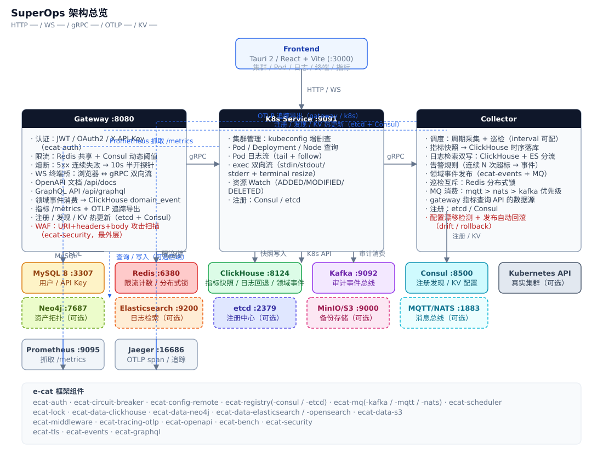
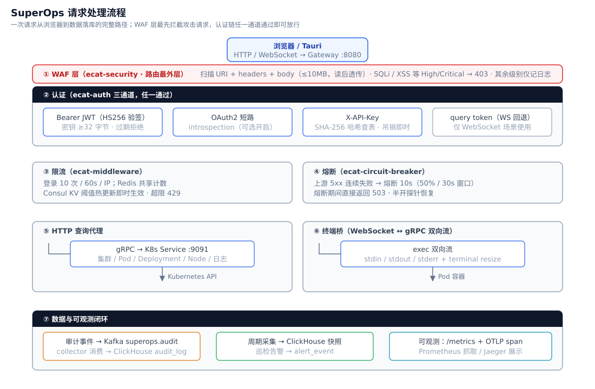
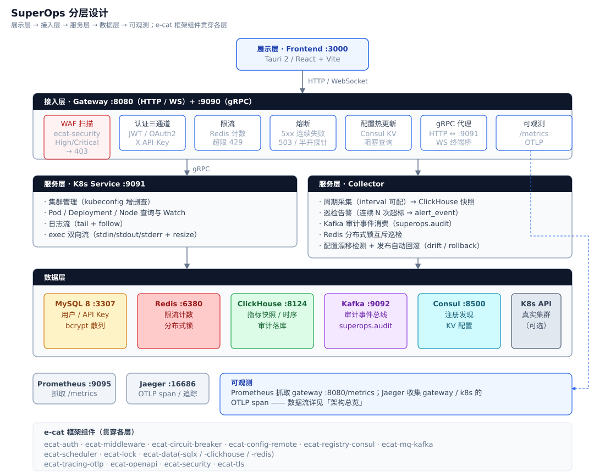
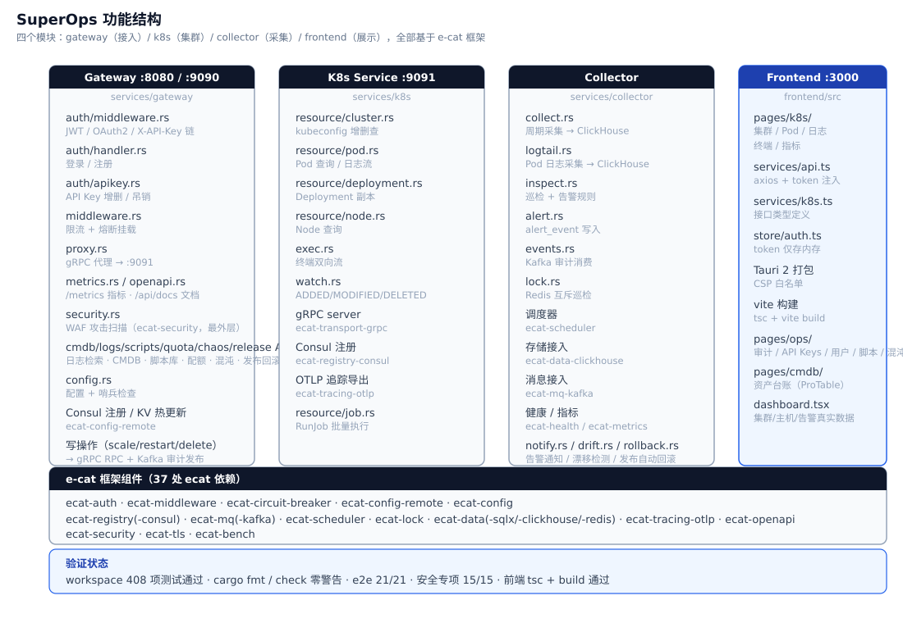
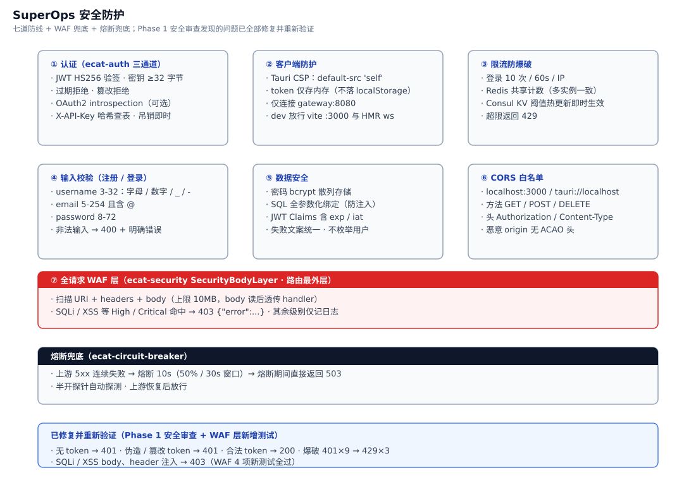
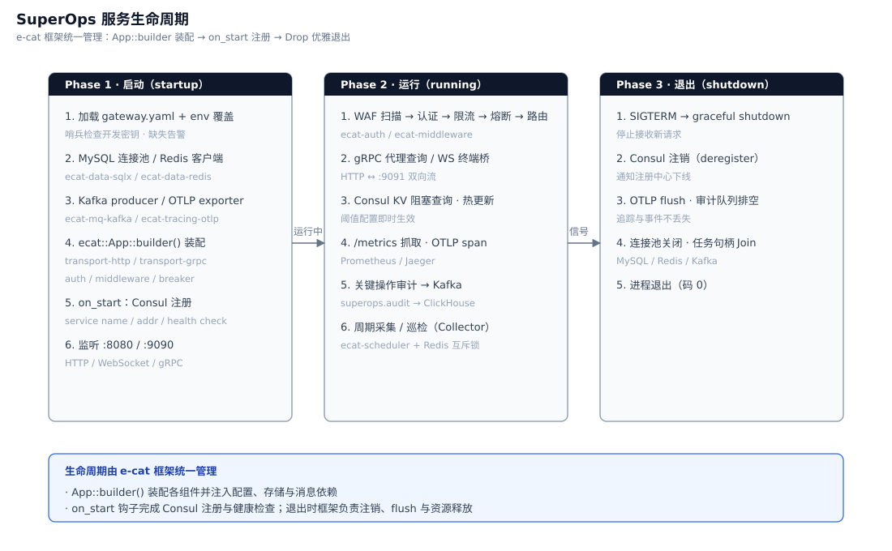
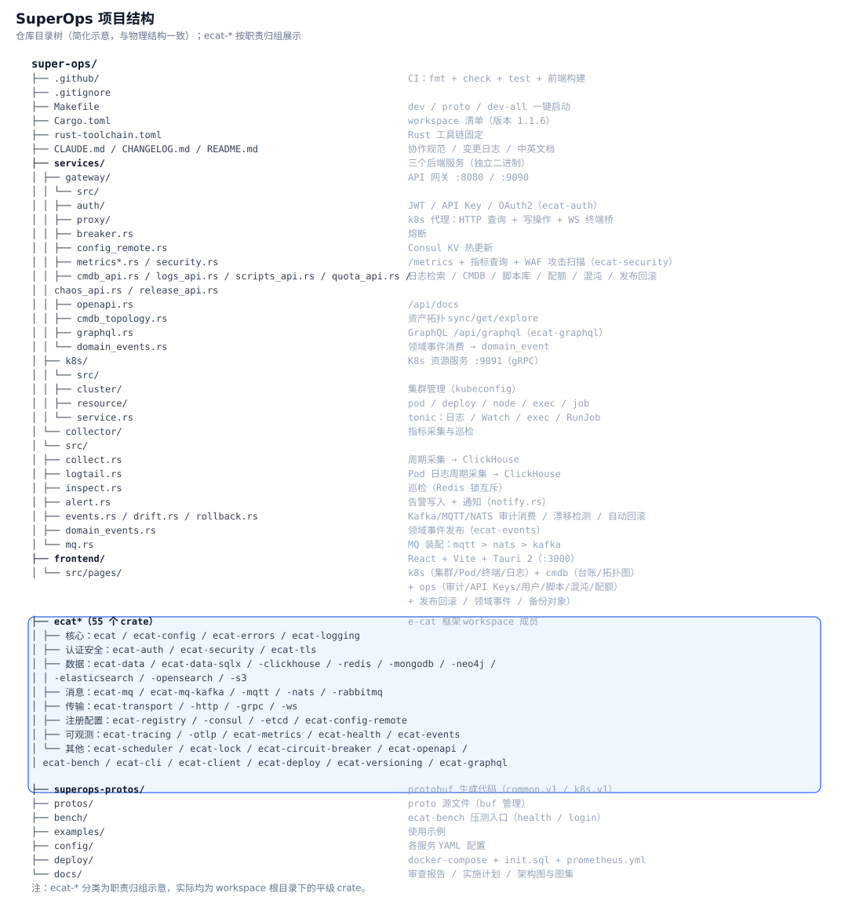

# SuperOps — 智能运维平台

基于 [e-cat](https://github.com/erik/e-cat) 框架生态构建的智能运维平台（v1.5.0）。API 网关统一承载认证、限流、熔断与反向代理；Kubernetes 资源服务提供查询、日志、Watch 与终端 exec；Collector 负责指标采集、巡检与告警；Tauri 桌面前端完成可视化操作。

## 项目说明

SuperOps 面向中小规模基础设施运维，提供一条从「看见」到「处置」的闭环链路：

- **看见**：集群资源（Pod/Deployment/Node）、Pod 日志、实时终端、指标快照与告警
- **韧性**：网关限流（Redis 共享计数 + Consul 动态阈值热更新）、熔断（5xx 连续失败自动半开）、认证（JWT / OAuth2 / API Key 三通道）
- **可观测**：Prometheus 指标抓取、OTLP 链路追踪（Jaeger）、ClickHouse 时序落库
- **协同**：Consul 注册发现 + 远程配置、Kafka 审计事件总线

四阶段演进（已全部完成）：P1 MVP（认证 + 资源查询）→ P2 韧性与可观测（熔断/限流/注册/追踪）→ P3 集成与对外（exec 终端、API Key、OAuth2、OpenAPI）→ P4–P6 运营闭环（P4 写操作/审计/用户管理 → P5 日志/CMDB/脚本库/RBAC → P6 治理/审批/多租户/保险库/录制/文件/告警/指标/Helm）。

## 技术架构

```
┌────────────┐   HTTP/WS  ┌─────────────┐   gRPC   ┌────────────┐
│  Frontend  │ ─────────► │   Gateway   │ ───────► │  K8s 服务   │ ──► Kubernetes API
│ Tauri/Web  │   :8080    │ auth+limit  │  :9091   │   :9091    │
└────────────┘            └──────┬──────┘          └────────────┘
                                 │ gRPC
                          ┌──────▼──────┐
                          │  Collector  │────► ClickHouse（指标快照/告警）
                          └──────┬──────┘
                                 │
     MySQL（用户/Key） Redis（限流/锁） Kafka（审计） Consul（注册/KV） Prometheus/Jaeger
```



**请求路径**：浏览器 → Gateway（认证 → 限流 → 熔断 → 代理）→ K8s Service（gRPC）→ Kubernetes API；终端场景经 WebSocket 桥接为 gRPC 双向流。**配置路径**：Consul KV `config/superops/gateway/*` 变更经阻塞查询实时推送，`rate.limit.max`/`rate.limit.window` 即时生效。**可观测路径**：Gateway 导出 `/metrics`（Prometheus 抓取）与 OTLP span（Jaeger 展示）。

### 架构图集











## 项目结构

```
super-ops/
├── services/                  # 后端服务（每个独立二进制）
│   ├── gateway/               #  API 网关 :8080
│   │   └── src/
│   │       ├── auth/          #    JWT 签发/校验（ecat-auth）、API Key、OAuth2 短路、登录注册
│   │       ├── proxy/         #    k8s 反向代理（HTTP 查询 + WS 终端桥）
│   │       ├── breaker.rs     #    熔断（FiveXx→Error 转换链）
│   │       ├── config_remote.rs #  Consul KV 热更新（DynamicRateLimitStore）
│   │       ├── metrics*.rs    #    Prometheus 导出 + 指标查询 API
│   │       ├── cmdb_api.rs / logs_api.rs / scripts_api.rs #  日志检索 / CMDB / 脚本库
│   │       ├── approval_api.rs #   审批工作流（delete 门禁）
│   │       ├── secrets_api.rs / vault.rs # 凭据保险库（AES-256-GCM，主密钥未配置 → 503）
│   │       ├── recordings_api.rs / recorder.rs # 终端录制（ClickHouse exec_session）
│   │       ├── files_api.rs   #    文件上传/下载（10MB multipart，MinIO）
│   │       ├── alerts_api.rs  #    告警中心（列表/确认）
│   │       └── openapi.rs     #    /api/docs 文档
│   ├── k8s/                   #  K8s 资源服务 :9091（gRPC）
│   │   └── src/
│   │       ├── cluster/       #    集群管理（kubeconfig 增删查）
│   │       ├── resource/      #    pod/deploy/node/exec/metrics + job(RunJob) 查询
│   │       └── service.rs     #    tonic 服务实现（日志流/Watch/exec 双向流 + RunJob）
│   └── collector/             #  指标采集、巡检与日志采集
│       └── src/
│           ├── collect.rs     #    周期采集 → ClickHouse 快照
│           ├── logtail.rs     #    Pod 日志采集 → ClickHouse
│           ├── inspect.rs     #    巡检（Redis 分布式锁互斥）
│           ├── alert.rs       #    告警规则与事件写入
│           ├── housekeeping.rs #   治理：MySQL 备份 / 容量与成本估算
│           └── events.rs      #    Kafka 审计事件消费
├── frontend/                  # React + Vite + Tauri 2（:3000）
│   └── src/pages/            #  k8s（集群/Pod/Node/终端/日志）+ cmdb + ops（审计/API Keys/用户/脚本/告警/指标）
├── ecat-*/                    # e-cat 框架组件（workspace 成员）
├── superops-protos/           # protobuf 生成代码（common.v1 / k8s.v1）
├── protos/                    # proto 源文件（buf 管理）
├── bench/                     # ecat-bench 压测入口（login）
├── config/                    # 各服务 YAML 配置
├── deploy/                    # docker-compose.yml + init.sql + prometheus.yml + helm/superops（Chart）
└── docs/                      # 审查报告 / 实施计划 / 架构图
```



## 功能说明

### Gateway（:8080）
| 功能 | 说明 |
|---|---|
| 认证 | 登录/注册；JWT 签发/校验基于框架 ecat-auth（HS256、`AuthClaims` 统一注入、密钥 ≥32 字节强制校验）；可选 OAuth2 层（ecat-auth，配置 `oauth2` 段即启用）；`X-API-Key` 内存表鉴权（吊销即时生效）；WS 场景支持 query token 回退；角色体系 admin/operator/viewer（首个注册用户自动 admin；operator 含 api:read/api:write/ops:audit/ops:cmdb/ops:scripts，viewer 仅 api:read；API Key 按用户角色走同一映射） |
| 限流 | 登录 10 次/60s/IP；Redis 共享计数（不可用自动回退内存）；阈值经 Consul KV 动态调整 |
| 熔断 | k8s 代理路由 5xx 连续失败熔断 10s（失败率 50%/窗口 30s/半开探针 3），期间 503 |
| 代理 | `/api/k8s/*` → gRPC 转发（查询 + scale/restart/delete 写操作）；`/exec` WebSocket ↔ gRPC 双向流（含 terminal resize，写路由 require_role("api:write")）；写操作成功发布 Kafka 审计事件（`k8s.scale`/`k8s.restart`/`k8s.delete`，payload 含 `level: "INFO"`） |
| 日志检索 | `GET /api/logs/search`：ClickHouse 日志检索（collector logtail 采集落库），require_role("api:read") |
| CMDB 资产 | `/api/cmdb/assets`（GET 列表 / POST 创建）、`/api/cmdb/assets/{id}`（DELETE）、`/api/cmdb/stats`（GET 统计），require_role("ops:cmdb") |
| 脚本库 | `/api/scripts`（GET/POST）、`/api/scripts/{id}`（DELETE）、`/api/scripts/{id}/run`（POST → k8s Job 批量执行）、`/api/scripts/runs`（GET 运行记录），仅支持 shell（busybox:1.36），require_role("ops:scripts") |
| 审批 | 删除 deployment 门禁（`approval.enabled` 时未审批删除返回 412）；`GET/POST /api/approvals`（kind=delete，target 约定 `"{cluster_id}/{ns}/{name}"`）、`POST /api/approvals/{id}/decide`；**默认关闭** |
| 多租户 | `x-tenant-id` 请求头经 `require_tenant` 中间件解析（仅小写字母/数字/连字符 1..=64，非法/缺失回落 `default`）；cmdb/scripts 数据按 `tenant_id` 隔离 |
| 保险库 | `/api/secrets`（GET 列表 / POST 创建 / GET+DELETE 单条，AES-256-GCM 加密）；`SUPEROPS_MASTER_KEY` 未配置或非 32 字节 → 全部接口 503；密文值不入日志 |
| 录制 | exec WebSocket 帧旁路写入 ClickHouse `exec_session`；`/api/recordings`（GET 列表）、`/api/recordings/{sid}/frames`（GET，上限 5000 帧）、`/api/recordings/{sid}`（DELETE），read api:read / write api:write |
| 文件 | `POST /api/files`（multipart 10MB 上限，文件名白名单）+ `GET /api/files/{name}`，MinIO 存储，api:write/api:read |
| 告警中心 | `GET /api/alerts?level=&limit=50`（ClickHouse `alert_event`，ops:cmdb）、`POST /api/alerts/{id}/ack`（api:write，幂等）、`GET /api/alerts/acks` |
| 指标看板 | 前端 `/ops/metrics` 复用 `GET /api/v1/metrics/query`（api:read） |
| 治理 | collector `housekeeping`：MySQL 备份（mysqldump → `data/backups`，保留 N 份）、磁盘容量与成本估算（collector.yaml `housekeeping:` 段） |
| 可观测 | `/health`、`/ready`（含 MySQL 依赖检查）、`/metrics`（Prometheus）、`/api/docs`（OpenAPI 3.0.3）、OTLP span（gateway/k8s/collector 三服务） |
| 运维 | Consul 注册 + `discover("superops-k8s")` 端点解析（失败回退静态配置）；KV 热更新 |

### K8s Service（:9091）
集群管理（kubeconfig）、Pod/Deployment/Node 查询（Node 含 Ready 状态与 kubelet 版本）、Deployment scale/restart/delete 写操作（gRPC `ScaleDeployment`/`RestartDeployment`/`DeleteDeployment`）、批量执行（gRPC `RunJob` → batch/v1 Job，shell 脚本）、Pod 日志流（tail/follow）、资源 Watch（ADDED/MODIFIED/DELETED）、exec 双向流（stdin/stdout/stderr + resize）。

### Collector
按调度周期采集指标 → ClickHouse 快照；日志采集（logtail.rs：周期采集 Pod 日志 → ClickHouse）；巡检任务经 Redis 锁保证单实例执行；告警规则（连续 N 次超标）写入事件；告警通知（generic/钉钉/企微 webhook + 按目标静默窗口，默认 300s）；治理任务（housekeeping.rs：MySQL 备份 + 容量/成本估算）；Kafka 审计事件消费（ecat-mq-kafka）；OTLP span 导出。

### Frontend（:3000）
登录、集群列表/详情、Pod 列表与日志、Deployment、Node、终端页（WS 双向流，token query 鉴权、binaryType 处理、可选容器）；dashboard 三个卡片接入真实接口（集群数 / Docker 主机数（metrics query，临时指标 app）/ 活跃告警（P6 起接告警中心接口））；CMDB 资产页（`/cmdb`，ProTable + 新建弹窗，菜单位于 Kubernetes 与运维中心之间）；脚本库页（`/ops/scripts`，脚本列表 + 运行记录双 ProTable）；运维中心（`/ops/audit` 审计、`/ops/apikeys` API Key、`/ops/users` 用户管理、`/ops/alerts` 告警中心（10s 轮询 + 确认）、`/ops/metrics` 指标看板（复用 metrics query））。

### API 一览（OpenAPI 见 /api/docs）
`/api/auth/register|login`、`/api/keys`（CRUD）、`/api/users`（`PATCH /{id}/status` 启用/禁用）、`/api/audit/events`（审计查询，limit/offset/level）、`/api/logs/search`（日志检索）、`/api/cmdb/assets`（GET/POST）、`/api/cmdb/stats`（GET）、`/api/cmdb/assets/{id}`（DELETE）、`/api/scripts`（GET/POST）、`/api/scripts/{id}`（DELETE）、`/api/scripts/{id}/run`（POST）、`/api/scripts/runs`（GET）、`/api/approvals`（GET/POST，delete 审批门禁）、`/api/approvals/{id}/decide`（POST）、`/api/secrets`（GET/POST）、`/api/secrets/{name}`（GET/DELETE）、`/api/recordings`（GET）、`/api/recordings/{sid}`（DELETE）、`/api/recordings/{sid}/frames`（GET）、`/api/files`（POST 上传）、`/api/files/{name}`（GET 下载）、`/api/alerts`（GET，level/limit）、`/api/alerts/{id}/ack`（POST）、`/api/alerts/acks`（GET）、`/api/k8s/clusters[/{id}][/pods|/deployments|/nodes|/metrics]`、`/api/k8s/clusters/{id}/pods/{ns}/{pod}/logs|exec`、`/api/k8s/clusters/{id}/deployments/{ns}/{name}/scale|restart`（`DELETE` 删除）、`/api/v1/metrics/query`、`/api/health`、`/api/docs`。

## 快速开始

```bash
# 1. 基础设施（MySQL 3307 / Redis 6380 / ClickHouse 8124 / Prometheus 9095 /
#    Kafka 9092 / Consul 8500 / Jaeger 4317+16686 / MinIO 9002+9003）
cd deploy && cp .env.example .env && sudo docker compose up -d

# 2. 生成 protobuf（首次或 proto 变更后）
make proto

# 3. 后端（三个服务）
make dev          # cargo build gateway + k8s-service + collector
cd services/gateway && GATEWAY_CONFIG=../../config/gateway.yaml cargo run &
cd services/k8s && K8S_CONFIG=../../config/k8s-service.yaml cargo run &
cd services/collector && COLLECTOR_CONFIG=../../config/collector.yaml cargo run &

# 4. 前端
cd frontend && npm install && npm run dev    # http://localhost:3000
```

或一键：`make dev-all`（compose + 后端 + 前端）。

测试账号（本地开发库）：`erik / Test1234!`

## 端口

| 组件 | 端口 |
|---|---|
| gateway HTTP | 8080 |
| gateway gRPC | 9090 |
| k8s service gRPC | 9091 |
| collector | 0（仅任务） |
| frontend (vite) | 3000 |
| MinIO | 9002 (API) / 9003 (console) |
| MySQL | 3307 |
| Redis | 6380 |
| ClickHouse | 8124 (HTTP) / 9001 (native) |
| Prometheus | 9095 |
| Kafka | 9092 |
| Consul | 8500 |
| Jaeger | 4317 (OTLP) / 16686 (UI) |

## 配置

| 环境变量 | 用途 |
|---|---|
| `GATEWAY_CONFIG` / `K8S_CONFIG` / `COLLECTOR_CONFIG` | 各服务配置 YAML 路径 |
| `SUPEROPS_JWT_SECRET` | JWT 签名密钥（生产必设，≥32 字节；缺省有 WARN 并沿用默认值） |
| `SUPEROPS_MASTER_KEY` | 保险库主密钥（32 字节；未设置时 `/api/secrets` 503） |
| `MINIO_ROOT_USER` / `MINIO_ROOT_PASSWORD` | MinIO 凭据（`deploy/.env`，生产必改） |
| `RUST_LOG` | tracing 级别（缺省 info） |

基础设施密码通过 `deploy/.env` 注入 compose（模板见 `deploy/.env.example`）；各服务 YAML 见 `config/`。

## 测试与 CI

- workspace 单测/集成测试 358 项全过（gateway 71 / k8s 14 / collector 31 / ecat 组件，见 `docs/audit-report-2026-08-06.md` 测试矩阵）
- 端到端与安全验证：登录/注册、k8s 路由正误路径、认证绕过、JWT 伪造、限流 429、熔断 503、API Key 生命周期（见 `docs/audit-report-2026-08-06.md`）
- 运行时验证：Consul 注册/注销、KV 热更新（阈值 3↔10 双向生效）、Jaeger span、Prometheus target up
- CI（`.github/workflows/ci.yml`）：`cargo fmt --check` + `cargo check` + `cargo test` + `npm run build`

## 已知边界

- **OAuth2**：默认关闭；开启需配置 `oauth2` 段（introspection URL + client id/secret）与外部 IdP
- **主密钥**：`SUPEROPS_MASTER_KEY` 默认未设置（未设置或非 32 字节时 `/api/secrets` 全部 503，两态可用）；生产启用保险库前必须设置
- **审批开关**：`approval.enabled` 默认关闭（`config/gateway.yaml`），开启后删除 deployment 需先提交并审批通过 delete 审批单（412 门禁）
- **exec 终端**：需真实 k8s 集群，且角色需 operator+（写路由 require_role("api:write")）；无集群时返回明确错误帧
- **OTLP 覆盖**：gateway HTTP 路径 + k8s gRPC + collector 调度均接入 OTLP span；录制旁路写入等非阻塞路径无 resource 字段（非阻塞项）
- **单实例部署**：限流计数为 Redis 共享，但服务本身单实例

## 文档

- `docs/audit-report-2026-08-06.md` — 全量审查报告（测试矩阵、安全清单、修复记录）
- `docs/images/` — 架构图与图集（architecture / flow / design / structure / security / lifecycle）
- `docs/superpowers/plans/` — 各阶段实施计划（P1 MVP / P2 韧性 / P3 集成）
- `CHANGELOG.md` — 变更日志

## 支持

如果这个项目对你有帮助，欢迎扫码支持（支付宝 / 微信均可）：

| 支付宝 | 微信 |
|---|---|
|  |  |
